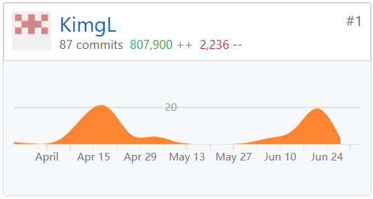

### 一、课程学习自我总结
   良好的需求分析和设计是能使整个的项目小走弯路，可以说是整个项目的的基础，透过小组项目的开发使我更加明白这个道理。清晰的项目规划有效减低前后端的误会，
   使整个开发更有效率。我是负责后端的开发，确保服务器能与前端交互是我的主要任务，所以数据库的设计及api的设计就是关键，合理的设计能减少与前端的误会。透
   过小组项目的开发，让我能应用到系统分析与设计课程的各个知识，也明白到课程的重要性。

### 二、PSP 2.1统计表
| PSP2.1                  |	任务内容	                     | 计划完成需要的时间(hour) | 实际完成需要的时间(hour) |
| :--------------------:  |  :----------------------------: |  :------------------: | :--------------------: |
|Planning	              | 计划	                          |  3                     |	       5              |
|Development              |	开发                           |	30	                   |         40             |
|Analysis	              | 需求分析 (包括学习新技术)          |	 4	                   |         3              |
|Design Spec              |	生成设计文档                    |	 3                    |	         3              |
|Design Review            | 设计复审 (审核设计文档)            |	2                    |	        3              |
|Coding Standard          | 代码规范 (为目前的开发制定合适的规范)|  2	                  |          2              |
|Design	                 | 具体设计                         |	10	                  |         13             |
|Coding	                 | 具体编码                         |	15	                  |         15             |
|Code Review	           | 代码复审	                        |   4                    |	        5              |
|test	                    | 测试（自我测试，修改代码，提交修改） |	 5                    |	        4              |
|Reporting                |	报告                           |	  2                 |     	    3             | 
|Size Measurement         |	计算工作量	                    |   1                    |	        1             |
|Postmortem	              | 事后总结                         |	 2                    |	         2             |
|Process Improvement Plan |	提出过程改进计划                |   2                    |	        4             |
|Summary                  |	合计                           |	  55	               |          72           |

### 三、个人分支的git统计报告

### 四、个人体会
通过进行后端的开发，了解到nodejs语言、express框架及mongodb。透过整个的开发对后端的运作有了初步的认识，包括服务器的搭建（利用阿里云）、环境的配置、与
前端的接合。因为时间的限制，后端只实现了基本的api，很多可拓展的功能及有待实现（包括增加api接口、效率优化）。整体来说获益良多！

### 五、个人技术博客
[利用nodejs及express框架开发心得]https://github.com/SAAD-CAT/Scan-code-ordering-system/blob/master/report/liqiming14331133/14331133_study_record.md)
