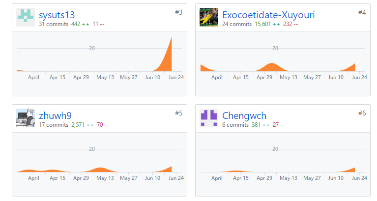

### 一、简短的课程学习自我总结
   需求分析和设计是整个软件开发过程的基石，文档的清晰和完备是降低沟通成本的最有效方法。通过一个学期的分析、设计与开发，我们小组各个成员都很好的完成了
各自的任务，就我个人而言，收获颇丰。我是负责前端客户界面的设计的，在分析与设计过程中学到了很多，比如jquery的使用，mui前端UI框架的合理应用，与服务器
开发人员的合理沟通来对接API等。总的来说，通过这一次大作业，真正体会到了一个软件从需求分析开始到项目最终交付完成的整个过程。

### 二、PSP 2.1统计表
| PSP2.1                  |	任务内容	                     | 计划完成需要的时间(hour) | 实际完成需要的时间(hour) |
| :--------------------:  |  :----------------------------: |  :------------------: | :--------------------: |
|Planning	              | 计划	                          |  3                     |	       4              |
|Development              |	开发                           |	50	                   |         60             |
|Analysis	              | 需求分析 (包括学习新技术)          |	 2	                   |         3              |
|Design Spec              |	生成设计文档                    |	 3                    |	         3              |
|Design Review            | 设计复审 (审核设计文档)            |	2                    |	        3              |
|Coding Standard          | 代码规范 (为目前的开发制定合适的规范)|  2	                  |          2              |
|Design	                 | 具体设计                         |	10	                  |         13             |
|Coding	                 | 具体编码                         |	12	                  |         10             |
|Code Review	           | 代码复审	                        |   4                    |	        5              |
|test	                    | 测试（自我测试，修改代码，提交修改） |	 5                    |	        7              |
|Reporting                |	报告                           |	  3                 |     	    4             | 
|Size Measurement         |	计算工作量	                    |   1                    |	        1             |
|Postmortem	              | 事后总结                         |	 3                    |	         4             |
|Process Improvement Plan |	提出过程改进计划                |   3                    |	        5             |
|Summary                  |	合计                           |	  53	               |          64           |

### 三、个人分支的git统计报告

### 四、个人体会
通过对前端web的开发，对前端框架等有了更深的体会，同时也懂得了如何更好的与后端开发人员沟通和对接。

### 五、个人技术博客
[学习react.js心得](https://blog.csdn.net/qq_34200964/article/details/79950116)
